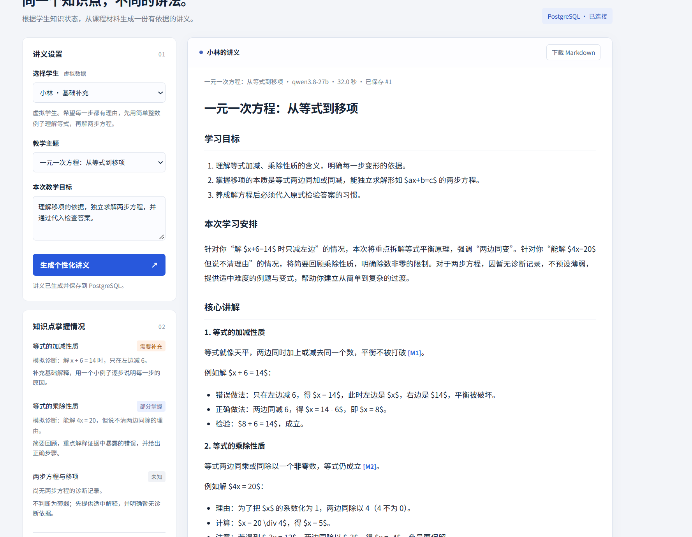

# 项目周报：个性化讲义生成 Demo

**汇报日期：2026 年 9 月 17 日**

**项目阶段：最小可运行版本**

**团队规模：3 人**

## 一、本周完成情况

本周主要完成了个性化讲义 Demo 的基础流程和本地运行配置。当前版本使用 Flask 提供网页和接口，使用 PostgreSQL 保存学生、知识点、课程材料和讲义记录，并通过课题组内网的 Qwen 接口生成讲义。

目前已经完成的内容包括：

- 建立独立数据库 `lecture_demo_prototype`，导入 3 名虚拟学生、3 个知识点和 3 条课程材料；
- 保存每名学生的知识点掌握状态及诊断依据；
- 实现按学生和主题查询知识状态、课程材料和引用来源；
- 接通 Qwen `chat/completions` 接口，生成包含目标、讲解、例题和引用的讲义；
- 实现网页展示、最近生成记录和 Markdown 下载；
- 在 Windows 环境完成 Python 依赖安装、数据库初始化和本地服务启动验证。

当前数据库初始化结果为：3 名学生、9 条学生—知识点状态、3 条课程材料。讲义记录会在网页成功生成后写入 `lectures` 表。

## 二、当前 Demo 流程

用户在网页中选择学生和方程主题后，系统会读取该学生对应的知识状态，再从数据库中查询相关课程材料，最后将学生特点、知识缺口和课程证据一起发送给模型。

三名虚拟学生用于展示不同的教学策略：

| 学生 | 当前策略 |
| --- | --- |
| 小林 | 补充基础概念和简单例子 |
| 小周 | 对比常见错误，重点解释符号和移项 |
| 小陈 | 减少重复说明，增加变式和迁移应用 |

生成结果会显示正文和引用来源。系统会检查模型引用的编号是否存在，但引用内容是否真正支持结论，仍需要人工核查。

## 三、目前没有实现的部分

本周先完成了文字资料和最小生成流程，以下内容暂未实现：

- PDF、课件和图片的自动解析；
- embedding、pgvector 和语义检索；
- OCR 及视觉语言模型对图表的解析；
- 登录、多课程管理和真实学生数据接入；
- 完整的教师审核、版本管理和效果评测流程。

这些内容属于后续扩展方向，不能视为当前 Demo 已经具备的功能。

## 四、遇到的问题与处理

本地部署过程中主要遇到两个问题：一是 Windows 环境下 PostgreSQL 连接需要在 `.env` 中明确填写用户名、密码和端口；二是 Windows 默认编码为 GBK，读取 UTF-8 的 `seed.json` 时需要启用 Python UTF-8 模式。处理后，数据库初始化和 Flask 服务均可以正常运行。

模型服务依赖课题组内网地址和 API Key。密钥只保存在本地 `.env`，不提交到 Git，也不放入浏览器端。

## 五、下一步计划

1. 补充一次完整的生成测试，比较同一主题下三名学生的讲义差异。
2. 检查引用内容、错误处理和模型超时情况，记录实际问题。
3. 根据测试结果调整提示词和讲义结构。
4. 再评估是否需要加入资料分块、向量检索和图片解析，不在没有测试数据前直接扩展实现。

## 六、后续成员分工

| 成员 | 后续负责内容 | 阶段性产出 |
| --- | --- | --- |
| 陈铭搏 | 维护 PostgreSQL 数据和初始化脚本；补充课程材料；检查学生状态与知识点的对应关系 | 可重复执行的数据库初始化流程，以及一组经过检查的课程材料 |
| 侯嘉庆 | 调整 Qwen 提示词和讲义结构；测试不同学生状态下的生成差异；处理超时、空响应和引用错误 | 生成效果对比记录、提示词版本和异常处理结果 |
| 冷俊杰 | 完善网页展示和讲义下载；整理测试步骤；记录讲义中的错误和需要人工修改的地方 | 可操作的演示页面、测试记录和问题清单 |

下一阶段三人共同完成接口联调，并用同一主题测试不同学生状态下的生成结果。
